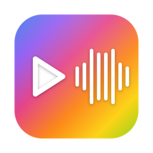

<div align="center">



# FCPX vers Pro Tools

**Convertis l'XML d'un projet Final Cut Pro en AAF prêt pour Pro Tools.**

Rôles audio, transcodage, poignées, marqueurs et vidéo de référence — en quelques clics.

[**🌐 Site web**](https://sandrophoto.github.io/fcpx-protools/) · [**⬇️ Télécharger**](https://github.com/sandrophoto/fcpx-protools/releases/latest) · macOS 13+ · gratuit

</div>

---

## À quoi ça sert

Quand on monte dans **Final Cut Pro** et qu'on confie le son à un **mixeur sur Pro Tools**,
il faut lui livrer un **AAF** propre. Cet app fait exactement ça : elle lit l'export
`.fcpxml` de ton projet, prépare les fichiers audio et génère un AAF que Pro Tools
(ou DaVinci Resolve / Fairlight) ouvre sans broncher. Inspiré de *X2Pro Audio Convert*.

## Fonctions

- 🎚️ **Rôles → pistes** — chaque rôle audio devient une piste, nommée et **réordonnable** par glisser-déposer
- 🧩 **Compounds aplatis** — les clips composés imbriqués sont résolus récursivement, à l'échantillon près
- 🌊 **Transcodage** — PCM **16 / 24 / 32-bit float**, conversion de sample-rate, sélection de canaux
- ✂️ **Portion utilisée + poignées** — découpe au segment utile + 1 à 4 s de poignées (bornées par la source)
- 📦 **Embarqué ou référencé** — AAF autonome (médias incorporés) ou léger (WAV externes liés)
- 🎬 **Vidéo de référence** — ajoute ton QuickTime guide comme piste image pour le mixeur
- 📍 **Marqueurs & chapitres** → marqueurs AAF
- 🎛️ **Fades & clip-gain** — gravés dans le média ou ignorés
- 🚫 **Exclusion** des clips désactivés
- ↻ **Mises à jour automatiques** via GitHub

## Installation

1. Télécharge la dernière version : [**Releases**](https://github.com/sandrophoto/fcpx-protools/releases/latest)
2. Décompresse et place **`FCPX vers ProTools.app`** dans `Applications`.
3. Au **premier lancement** : clic droit → **Ouvrir** (l'app est signée ad-hoc, non notarisée).

> Pré-requis : **macOS 13+**, `python3` et `ffmpeg` (via [Homebrew](https://brew.sh) : `brew install python ffmpeg`).
> Le moteur Python et `pyaaf2` sont embarqués dans l'app.

## Utilisation

L'app guide en **5 étapes**, révélées au fur et à mesure :

1. **Projet** — glisse ton fichier `.fcpxml` (ou `.fcpxmld`)
2. **Destination** — où enregistrer l'AAF et les fichiers
3. **Rôles** — coche et **ordonne** les pistes
4. **Médias** — indique les dossiers où trouver les fichiers audio (glisser-déposer)
5. **Options** — profondeur, sample-rate, médias, poignées, marqueurs, vidéo de référence… puis **Lancer**

## Architecture

| Couche | Détails |
|---|---|
| **Moteur** | Python — [`pyaaf2`](https://github.com/markreidvfx/pyaaf2) (écriture AAF) + [`ffmpeg`](https://ffmpeg.org) (transcodage / découpe) |
| **Interface** | macOS natif — **SwiftUI** (SwiftPM), pilote le moteur via une CLI JSON |
| **Mises à jour** | [Sparkle](https://sparkle-project.org) + GitHub Releases |

## Compiler depuis les sources

```bash
cd app
./make_app.sh release        # → dist/FCPX vers ProTools.app
```

Publier une nouvelle version (mainteneur) :

```bash
./publish.sh 1.1.3           # build + zip + appcast signé + Release GitHub
```

## Crédits

Réalisé par **STUPIDS STUDIO** — [Le studio](https://sandrophoto.github.io/#studio)

Propulsé par [pyaaf2](https://github.com/markreidvfx/pyaaf2), [FFmpeg](https://ffmpeg.org),
[Sparkle](https://sparkle-project.org) et SwiftUI.

© 2026 STUPIDS STUDIO — Tous droits réservés.
